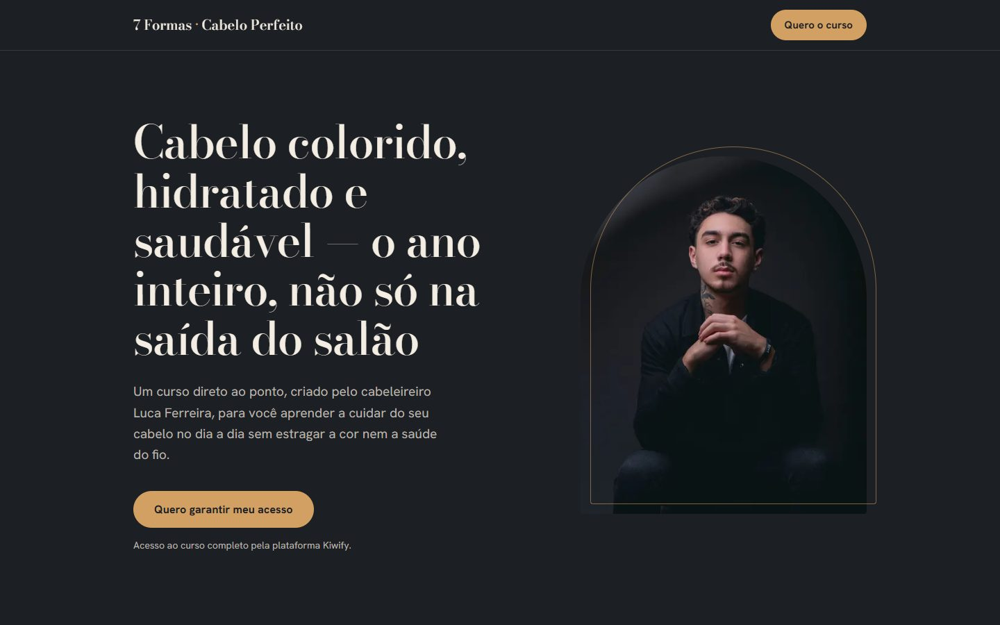
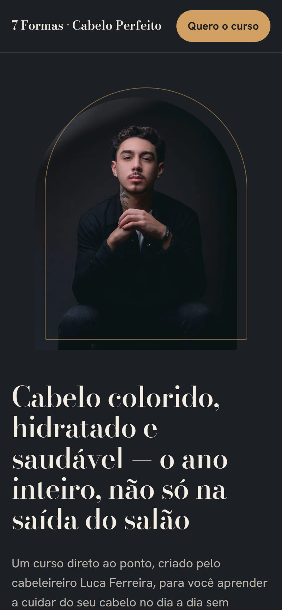

# 7 Formas de Ter o Cabelo Perfeito

Landing page de vendas para o curso online do cabeleireiro **Luca Ferreira**, feita para um cliente real. A página apresenta o professor e o conteúdo do curso e leva a pessoa até o checkout na Kiwify.

<p align="center">
  
  &nbsp;
  
</p>

## Conceito visual

O curso ensina a cuidar de cabelo colorido, então a página foi pensada como um **balayage**:

- **Começa escura como a raiz.** O fundo usa o mesmo tom de estúdio dos retratos do Luca, então as fotos se integram à página.
- **Clareia até o loiro mel das pontas.** Na seção "De uma rotina no improviso para uma rotina com direção", o fundo faz um degradê que vai do "Hoje" (escuro) ao "Com o curso" (claro). A partir dali, a página fica clara, junto com a foto do resultado no salão.
- **As fotos ficam em molduras em arco**, inspiradas nos espelhos de salão.

| Token | Cor | Uso |
|---|---|---|
| `--raiz` | `#1c1f23` | Fundo da zona escura |
| `--cacau` | `#5a4232` | Meio do degradê |
| `--mel` | `#d2a062` | Botões e destaques |
| `--luz` | `#f1e1c4` | Fundo da zona clara |

A tipografia usa **Bodoni Moda**, uma serifa de alto contraste típica de revistas de beleza, nos títulos e **Hanken Grotesk** no texto corrido.

## Estrutura

```
├── index.html          # Marcação semântica da página
├── css/style.css       # Estilos: tokens, componentes e responsivo
├── js/main.js          # Link do checkout e ano do rodapé
├── assets/
│   ├── favicon.svg
│   └── img/            # Fotos em WebP + JPG, em 3 tamanhos cada
├── docs/               # Capturas de tela para este README
└── netlify.toml        # Configuração de deploy e cache
```

## Destaques técnicos

- **HTML, CSS e JavaScript puros**, sem framework e sem etapa de build.
- **Imagens responsivas**: `<picture>` com WebP, JPG de fallback e `srcset` em 480, 800 e 1200 px. As fotos originais somavam 31 MB. Agora a página carrega menos de 1 MB.
- **Performance**: preload da foto principal, `loading="lazy"` nas demais imagens e `width`/`height` definidos para evitar layout shift.
- **Acessibilidade**: foco visível no teclado, contraste AA, FAQ com `<details>` nativo, respeito a `prefers-reduced-motion` e áreas de toque de 44 px ou mais.
- **Responsivo** do celular (a partir de 320 px) ao desktop, com `safe-area` para iPhone.
- **SEO e compartilhamento**: meta description e Open Graph para a prévia do link no WhatsApp e em redes sociais.
- **Um único link de checkout** em `js/main.js`, aplicado a todos os botões.

## Rodando localmente

Basta abrir o `index.html` no navegador. Também dá para usar um servidor local:

```bash
npx serve .
```

## Deploy

Hospedado na **Netlify** como site estático. O `netlify.toml` publica a raiz do projeto e configura o cache dos arquivos.

---

Desenvolvido por **[gomessites.com.br](https://gomessites.com.br)**, criação de sites e landing pages.
